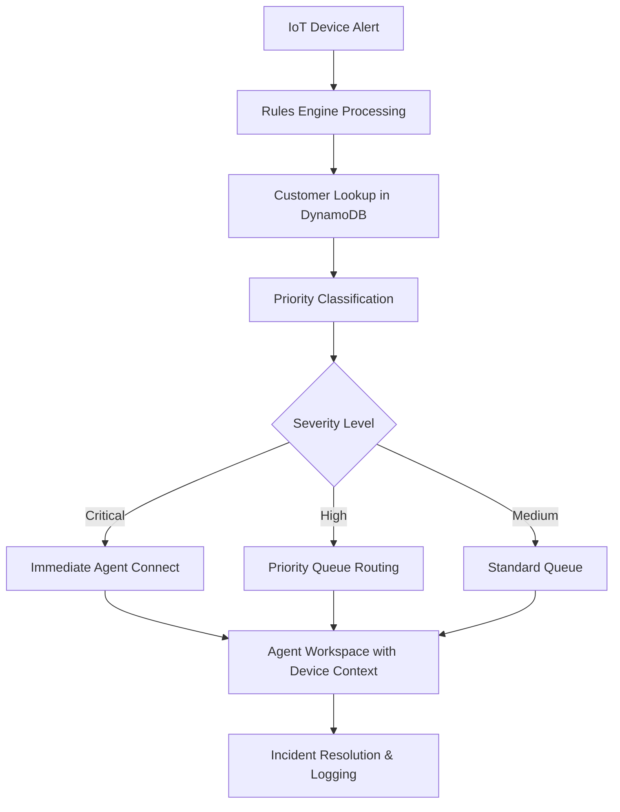

# AWS Connect Enterprise Architecture for Security Devices

## 1. Architecture Overview

This document outlines a comprehensive AWS Connect architecture designed for enterprises that handle security devices, providing secure, scalable contact center operations with integrated IoT device management.

## 2. Key Requirements Addressed

### Business Requirements
- **Enterprise Scale**: Support for 10,000+ concurrent agents across multiple regions
- **Security Device Integration**: Real-time monitoring and management of IoT security devices
- **Compliance**: SOC 2, PCI DSS, HIPAA, and enterprise security standards
- **High Availability**: 99.9% uptime with multi-region failover
- **Cost Optimization**: Pay-as-you-use model with resource optimization

### Security Requirements  
- **Zero Trust Architecture**: Never trust, always verify approach
- **End-to-End Encryption**: All data encrypted in transit and at rest
- **Device Authentication**: Strong X.509 certificate-based device identity
- **Network Isolation**: Private VPC endpoints for secure communication
- **Compliance Auditing**: Comprehensive logging and monitoring

### Integration Requirements
- **IoT Device Management**: Secure provisioning, monitoring, and lifecycle management
- **Real-time Alerting**: Immediate notification of security incidents
- **External Systems**: CRM, SIEM, ticketing systems integration
- **Analytics**: Advanced call analytics and device telemetry analysis

## 3. Core Architecture Components

### 3.1 Amazon Connect Core Infrastructure

```yaml
Amazon Connect Instance:
  Type: Enterprise
  Features:
    - Voice, Chat, Video calling
    - Multi-channel contact flows  
    - Agent workspace with custom applications
    - Real-time and historical analytics
    - Contact Lens for analytics

Contact Center Configuration:
  Regions: 
    Primary: us-east-1
    Secondary: us-west-2 
  Capacity:
    Concurrent Agents: 10,000+
    Daily Contacts: 1M+
    Peak Concurrent Calls: 50,000
```

### 3.2 Security Device Integration Layer

```yaml
AWS IoT Core:
  Device Registry: Central device identity management
  Device Shadow: Device state synchronization  
  Rules Engine: Real-time event processing
  Jobs: Remote device management and updates

Device Communication:
  Protocol: MQTT over TLS 1.2
  Authentication: X.509 certificates
  Authorization: Fine-grained IoT policies
  Connectivity: VPC endpoints for private communication

Device Types Supported:
  - Security cameras and sensors
  - Access control systems  
  - Intrusion detection devices
  - Environmental monitoring systems
  - Mobile security devices
```

### 3.3 Data Storage and Management

```yaml
Amazon DynamoDB:
  Tables:
    - DeviceRegistry: Device metadata and status
    - CustomerProfiles: Enhanced customer information
    - IncidentHistory: Security incident tracking
    - ContactHistory: Detailed interaction logs
    
  Configuration:
    - Global Tables for multi-region
    - Point-in-time recovery enabled
    - Encryption at rest with KMS
    - Auto-scaling enabled

Amazon S3:
  Buckets:
    - call-recordings: Encrypted call recordings
    - device-telemetry: IoT device data lake  
    - analytics-reports: Generated reports and analytics
    - backup-data: Long-term retention and compliance
```

## 4. Advanced Contact Flows

### 4.1 Security Device Alert Flow



### 4.2 Intelligent Routing Logic

```python
# Lambda function for intelligent routing
def lambda_handler(event, context):
    device_id = event['deviceId']
    alert_type = event['alertType']
    customer_tier = get_customer_tier(device_id)
    
    # Route based on device type and customer tier
    if alert_type == 'SECURITY_BREACH':
        queue = 'security-emergency-queue'
        priority = 1
    elif customer_tier == 'PREMIUM':
        queue = 'premium-support-queue' 
        priority = 2
    else:
        queue = 'standard-support-queue'
        priority = 3
        
    return route_to_queue(queue, priority, device_context)
```

## 5. Security Implementation

### 5.1 Network Security Architecture

```yaml
VPC Configuration:
  CIDR: 10.0.0.0/16
  Subnets:
    - Public: 10.0.1.0/24 (NAT Gateway)
    - Private: 10.0.2.0/24 (Connect resources)
    - Isolated: 10.0.3.0/24 (Database tier)

VPC Endpoints:
  - com.amazonaws.region.connect
  - com.amazonaws.region.iot.data
  - com.amazonaws.region.iot.credentials
  - com.amazonaws.region.s3
  - com.amazonaws.region.dynamodb

Security Groups:
  ConnectSG:
    Inbound: HTTPS (443) from CloudFront
    Outbound: All traffic to AWS services
    
  IoTDevicesSG:  
    Inbound: MQTTS (8883) from device networks
    Outbound: AWS IoT endpoints only
```

### 5.2 Identity and Access Management

```json
{
  "Version": "2012-10-17",
  "Statement": [
    {
      "Sid": "ConnectAgentAccess",
      "Effect": "Allow", 
      "Principal": {"AWS": "arn:aws:iam::account:role/ConnectAgentRole"},
      "Action": [
        "connect:*",
        "dynamodb:Query",
        "dynamodb:GetItem"
      ],
      "Resource": "*",
      "Condition": {
        "StringEquals": {
          "aws:SourceVpc": "vpc-connect-instance"
        }
      }
    }
  ]
}
```

### 5.3 Encryption Strategy

```yaml
Encryption at Rest:
  DynamoDB: AWS KMS customer-managed keys
  S3: SSE-KMS with key rotation
  Connect: Default AWS managed encryption
  IoT: Device certificates + payload encryption

Encryption in Transit:  
  Connect API: TLS 1.2+ 
  IoT Communication: MQTT over TLS 1.2
  Agent Workstation: HTTPS with certificate pinning
  Inter-service: VPC endpoints with TLS
```

## 6. Monitoring and Analytics

### 6.1 Real-time Monitoring

```yaml
CloudWatch Metrics:
  Connect Metrics:
    - CallsInQueue
    - AgentAvailability  
    - AverageHandleTime
    - CustomerSatisfaction
    
  IoT Metrics:
    - DeviceConnectivity
    - MessageThroughput
    - AlertFrequency
    - DeviceHealth

CloudWatch Alarms:
  - High queue wait times (> 2 minutes)
  - Device offline alerts (> 5 minutes)  
  - Failed authentication attempts (> 10/hour)
  - API error rates (> 1%)
```

### 6.2 Analytics and Reporting

```yaml  
Amazon Kinesis Data Streams:
  - connect-contact-records
  - iot-device-telemetry
  - real-time-analytics

Amazon OpenSearch:
  Indices:
    - contact-analytics
    - device-performance  
    - security-incidents
    - compliance-audit-logs

Custom Dashboards:
  - Executive KPI Dashboard
  - Operations Monitoring Dashboard  
  - Security Incident Dashboard
  - Device Health Dashboard
```

## 7. Integration Patterns

### 7.1 External System Integration

```yaml
API Gateway:
  Endpoints:
    - /devices/{id}/status (GET, PUT)
    - /incidents (GET, POST)  
    - /customers/{id}/devices (GET)
    - /analytics/reports (GET)
    
  Authentication: IAM with API Keys
  Rate Limiting: 1000 requests/second per API key
  
Lambda Functions:
  - device-status-processor
  - incident-escalation-handler
  - customer-context-enricher
  - analytics-report-generator
```

### 7.2 Event-Driven Architecture

```python
# EventBridge integration for security events
{
  "source": ["aws.iot"],
  "detail-type": ["IoT Device Alert"],  
  "detail": {
    "deviceId": "device-12345",
    "alertType": "UNAUTHORIZED_ACCESS",
    "severity": "HIGH",
    "timestamp": "2024-03-03T10:30:00Z"
  }
}

# Automated response via Step Functions
def security_incident_workflow():
    steps = [
        "validate_alert",
        "enrich_customer_context", 
        "create_connect_task",
        "notify_security_team",
        "update_incident_status"
    ]
    return step_function_execution(steps)
```

## 8. Disaster Recovery and Business Continuity

### 8.1 Multi-Region Setup

```yaml
Primary Region (us-east-1):
  - Amazon Connect primary instance
  - DynamoDB global tables (primary)
  - S3 cross-region replication source
  - IoT device endpoints

Secondary Region (us-west-2):  
  - Amazon Connect disaster recovery instance
  - DynamoDB global tables (replica)
  - S3 cross-region replication target
  - IoT device failover endpoints

Failover Strategy:
  RTO: 15 minutes
  RPO: 1 minute  
  Automated failover: Yes
  Health check interval: 30 seconds
```

### 8.2 Backup and Recovery

```yaml
Backup Strategy:
  DynamoDB: Point-in-time recovery + daily snapshots
  S3: Versioning + cross-region replication  
  Connect: Configuration exports + contact flow backups
  
Recovery Testing:
  Frequency: Monthly
  Scenarios: Region failure, service outage, data corruption
  Success Criteria: RTO/RPO targets met
```

## 9. Compliance and Governance

### 9.1 Compliance Framework

```yaml
Standards Compliance:
  SOC 2 Type II: Yes
  PCI DSS Level 1: Yes  
  HIPAA: Yes (with BAA)
  ISO 27001: Yes
  GDPR: Yes (data residency controls)

Audit Requirements:
  - All API calls logged (CloudTrail)
  - Data access logging (CloudWatch)
  - Configuration change tracking
  - Quarterly compliance assessments
```

### 9.2 Data Governance

```yaml
Data Classification:
  Public: Marketing materials
  Internal: Operational metrics
  Confidential: Customer PII, device configurations
  Restricted: Security keys, compliance data

Data Retention:
  Call Recordings: 7 years (compliance requirement)
  Device Telemetry: 2 years (analytics)  
  Audit Logs: 10 years (regulatory)
  Customer Data: Per data retention policy

Data Privacy:
  Encryption: All sensitive data
  Access Controls: Role-based, least privilege
  Data Masking: PII in non-production environments
  Right to be Forgotten: Automated data deletion
```

## 10. Performance and Scalability

### 10.1 Scaling Strategy

```yaml
Auto Scaling Configuration:
  DynamoDB:
    Read Capacity: 1000-40000 RCU
    Write Capacity: 1000-40000 WCU
    Target Utilization: 70%
    
  Lambda:
    Concurrent Executions: 10000
    Memory: 512MB-3008MB (auto-optimized)
    Timeout: 15 minutes max
    
  Connect:  
    Agent Capacity: Auto-scaling enabled
    Queue Management: Dynamic routing
    Resource Allocation: Based on historical patterns
```

### 10.2 Performance Optimization

```yaml
Caching Strategy:
  ElastiCache (Redis):
    - Customer profile cache (TTL: 1 hour)
    - Device status cache (TTL: 5 minutes)
    - Session data cache (TTL: 24 hours)
    
  CloudFront:
    - Static assets (TTL: 24 hours)  
    - API responses (TTL: 5 minutes)
    - Device configuration (TTL: 1 hour)

Database Optimization:
  DynamoDB:
    - Global Secondary Indexes for query patterns
    - Partition key design for even distribution
    - Compression for large items
    - Batch operations for bulk updates
```

## 11. Cost Optimization

### 11.1 Cost Management Strategy

```yaml
Reserved Capacity:
  DynamoDB: 50% reserved for baseline workload
  Lambda: Provisioned concurrency for critical functions
  Connect: Committed usage for predictable capacity

Resource Optimization:
  S3:
    - Intelligent Tiering enabled
    - Lifecycle policies (IA after 30 days, Glacier after 90 days)
    - Compressed storage for telemetry data
    
  CloudWatch:
    - Log retention optimization (1 year for operational, 7 years for compliance)
    - Metric filtering to reduce ingestion costs
    - Custom metrics only for business-critical KPIs
```

### 11.2 Cost Monitoring

```yaml
Budget Alerts:
  - Monthly AWS spend > $50k (80% threshold)
  - Connect usage > planned capacity (90% threshold)  
  - DynamoDB consumed capacity > budget (85% threshold)
  - Data transfer costs > $5k (monthly)

Cost Allocation:
  Tags:
    - Department: Security, Operations, Customer Service
    - Environment: Production, Staging, Development  
    - Project: Device-Management, Contact-Center, Analytics
    - CostCenter: IT-Security, Customer-Operations
```

This architecture provides a robust, secure, and scalable foundation for enterprise contact centers handling security devices, with comprehensive monitoring, compliance, and integration capabilities.