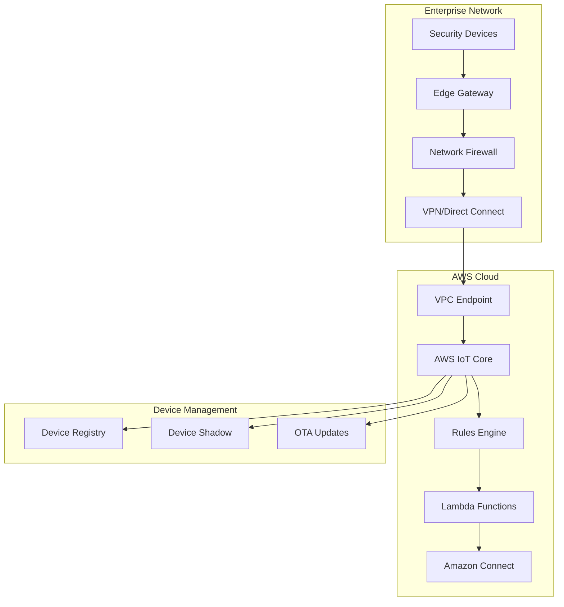

# Security Device Integration Architecture

## Overview
This document details the integration patterns for connecting enterprise security devices to AWS Connect, enabling real-time monitoring, alerting, and automated incident response.

## Device Types Supported

### 1. Physical Security Devices
```yaml
Access Control Systems:
  - Badge readers and card scanners
  - Biometric authentication devices  
  - Door locks and turnstiles
  - Visitor management systems

Surveillance Equipment:
  - IP cameras and NVR systems
  - Motion detection sensors
  - Facial recognition systems
  - License plate readers

Perimeter Security:
  - Intrusion detection sensors
  - Fence monitoring systems
  - Vibration sensors
  - Thermal imaging cameras
```

### 2. Environmental Security Devices
```yaml
Fire and Safety:
  - Smoke and heat detectors
  - Fire suppression systems
  - Emergency lighting systems
  - Mass notification systems

Environmental Monitoring:
  - Temperature and humidity sensors
  - Air quality monitors
  - Water leak detectors
  - Power monitoring systems
```

## Device Connectivity Architecture

### 1. Network Connectivity Patterns



### 2. Device Authentication & Security

```yaml
Certificate-Based Authentication:
  Root CA: AWS IoT Device CA or Private CA
  Device Certificates: Unique X.509 per device
  Certificate Rotation: Automated 90-day rotation
  Revocation: Real-time certificate revocation list

Communication Security:
  Protocol: MQTT over TLS 1.2 or 1.3
  Encryption: AES-256 end-to-end encryption
  Message Integrity: HMAC-SHA256
  Replay Protection: Message sequence numbering

Network Security:
  VPC Endpoints: Private connectivity to AWS IoT
  Security Groups: Restrictive firewall rules
  NACLs: Network-level access controls
  WAF: Protection against malicious traffic
```

## Real-Time Alert Processing

### 1. Alert Classification System

```python
# Alert severity classification
ALERT_SEVERITY = {
    'CRITICAL': {
        'examples': ['Security breach', 'Fire alarm', 'Intrusion detected'],
        'response_time': 30,  # seconds
        'escalation': 'immediate',
        'connect_queue': 'emergency-security'
    },
    'HIGH': {
        'examples': ['Door forced open', 'Camera malfunction', 'Access denied'],
        'response_time': 120,  # seconds  
        'escalation': 'priority',
        'connect_queue': 'priority-security'
    },
    'MEDIUM': {
        'examples': ['Badge not read', 'Network connectivity issues'],
        'response_time': 300,  # seconds
        'escalation': 'standard',
        'connect_queue': 'standard-security'
    },
    'LOW': {
        'examples': ['Maintenance reminders', 'Battery low warnings'],
        'response_time': 3600,  # seconds
        'escalation': 'scheduled',
        'connect_queue': 'maintenance'
    }
}
```

### 2. IoT Rules Engine Configuration

```json
{
  "ruleName": "SecurityDeviceAlerts",
  "sql": "SELECT * FROM 'topic/security/alerts' WHERE severity IN ('CRITICAL', 'HIGH')",
  "actions": [
    {
      "lambda": {
        "functionArn": "arn:aws:lambda:region:account:function:ProcessSecurityAlert"
      }
    },
    {
      "dynamoDBv2": {
        "roleArn": "arn:aws:iam::account:role/IoTRulesRole",
        "putItem": {
          "tableName": "SecurityIncidents"
        }
      }
    },
    {
      "sns": {
        "targetArn": "arn:aws:sns:region:account:critical-alerts",
        "roleArn": "arn:aws:iam::account:role/IoTRulesRole"
      }
    }
  ]
}
```

## Device Management Capabilities

### 1. Device Lifecycle Management

```yaml
Device Provisioning:
  Bulk Registration: CSV import for multiple devices
  Just-in-Time: Automatic registration on first connect
  Claim Certificates: Secure bootstrap process
  Fleet Provisioning: Template-based provisioning

Device Monitoring:
  Connectivity Status: Real-time online/offline tracking
  Health Metrics: Battery, signal strength, error rates
  Performance KPIs: Message latency, throughput
  Compliance Status: Certificate validity, policy adherence

Device Updates:
  OTA Firmware: Secure over-the-air updates
  Configuration Sync: Remote configuration management
  Rollback Capability: Automated rollback on failure
  Staged Deployment: Gradual rollout validation
```

### 2. Device Shadow Synchronization

```json
{
  "state": {
    "desired": {
      "configuration": {
        "alertThresholds": {
          "temperature": 75,
          "motion_sensitivity": "high",
          "recording_quality": "1080p"
        },
        "schedules": {
          "maintenance_window": "02:00-04:00",
          "monitoring_hours": "24/7"
        }
      }
    },
    "reported": {
      "status": {
        "online": true,
        "battery_level": 85,
        "signal_strength": -45,
        "last_alert": "2024-03-03T10:15:30Z"
      },
      "location": {
        "building": "HQ-East",
        "floor": 3,
        "zone": "Server Room"
      }
    }
  },
  "metadata": {
    "desired": {
      "configuration": {
        "timestamp": 1709467530
      }
    }
  },
  "version": 45,
  "timestamp": 1709467530
}
```

## Integration with Amazon Connect

### 1. Automated Case Creation

```python
import boto3
import json
from datetime import datetime

def create_connect_task(alert_data):
    """Create Amazon Connect task for security incident"""
    
    connect_client = boto3.client('connect')
    
    task_template = {
        'InstanceId': 'arn:aws:connect:region:account:instance/instance-id',
        'Name': f"Security Alert: {alert_data['device_type']} - {alert_data['alert_type']}",
        'Description': f"Automated security incident from device {alert_data['device_id']}",
        'ContactFlowId': 'arn:aws:connect:region:account:instance/instance-id/contact-flow/flow-id',
        'Attributes': {
            'DeviceId': alert_data['device_id'],
            'AlertType': alert_data['alert_type'], 
            'Severity': alert_data['severity'],
            'Location': alert_data['location'],
            'Timestamp': alert_data['timestamp'],
            'CustomerContext': json.dumps(get_customer_context(alert_data['device_id']))
        }
    }
    
    try:
        response = connect_client.start_task_contact(**task_template)
        return {
            'statusCode': 200,
            'contactId': response['ContactId'],
            'message': 'Task created successfully'
        }
    except Exception as e:
        return {
            'statusCode': 500,
            'error': str(e)
        }
```

### 2. Customer Context Enrichment

```python
def get_customer_context(device_id):
    """Retrieve customer context for device"""
    
    dynamodb = boto3.resource('dynamodb')
    device_table = dynamodb.Table('DeviceRegistry')
    customer_table = dynamodb.Table('CustomerProfiles')
    
    # Get device information
    device_response = device_table.get_item(Key={'device_id': device_id})
    device_info = device_response.get('Item', {})
    
    # Get customer information  
    customer_id = device_info.get('customer_id')
    if customer_id:
        customer_response = customer_table.get_item(Key={'customer_id': customer_id})
        customer_info = customer_response.get('Item', {})
        
        return {
            'customer_name': customer_info.get('company_name'),
            'contact_phone': customer_info.get('primary_phone'),
            'support_tier': customer_info.get('support_tier', 'standard'),
            'service_hours': customer_info.get('service_hours', '24/7'),
            'escalation_contacts': customer_info.get('escalation_contacts', []),
            'device_location': device_info.get('installation_address'),
            'device_type': device_info.get('device_type'),
            'warranty_status': device_info.get('warranty_status'),
            'maintenance_schedule': device_info.get('next_maintenance')
        }
    
    return {'error': 'Customer context not found'}
```

## Security Controls Implementation

### 1. Zero Trust Device Access

```yaml
Device Authentication:
  Multi-Factor: Certificate + device fingerprinting
  Continuous Verification: Ongoing behavior analysis
  Least Privilege: Minimal required permissions only
  Context Aware: Location and time-based access

Network Segmentation:
  Device VLANs: Isolated network segments per device type
  Micro-segmentation: Individual device security boundaries  
  Jump Hosts: Secure administrative access only
  Monitoring: All traffic inspection and logging
```

### 2. Threat Detection and Response

```python
# Anomaly detection for device behavior
def detect_device_anomalies(device_metrics):
    """Detect unusual device behavior patterns"""
    
    anomalies = []
    
    # Check for unusual message frequency
    if device_metrics['messages_per_hour'] > device_metrics['baseline'] * 3:
        anomalies.append({
            'type': 'HIGH_MESSAGE_FREQUENCY',
            'severity': 'MEDIUM',
            'description': 'Device sending unusually high number of messages'
        })
    
    # Check for unexpected offline periods
    if device_metrics['offline_duration'] > 300:  # 5 minutes
        anomalies.append({
            'type': 'EXTENDED_OFFLINE',
            'severity': 'HIGH', 
            'description': 'Device offline longer than expected'
        })
    
    # Check for authentication failures
    if device_metrics['auth_failures'] > 5:
        anomalies.append({
            'type': 'AUTHENTICATION_FAILURES',
            'severity': 'CRITICAL',
            'description': 'Multiple authentication failures detected'
        })
    
    return anomalies

# Automated response actions
def execute_security_response(anomaly_type, device_id):
    """Execute automated security response"""
    
    responses = {
        'AUTHENTICATION_FAILURES': [
            'disable_device_temporarily',
            'notify_security_team', 
            'create_incident_ticket',
            'increase_monitoring'
        ],
        'HIGH_MESSAGE_FREQUENCY': [
            'throttle_device_messages',
            'analyze_message_content',
            'check_device_compromise'
        ],
        'EXTENDED_OFFLINE': [
            'ping_device',
            'check_network_connectivity',
            'dispatch_technician_if_needed'
        ]
    }
    
    return responses.get(anomaly_type, ['create_incident_ticket'])
```

This security device integration provides comprehensive device management, real-time alerting, and automated incident response capabilities integrated with Amazon Connect for enterprise security operations.